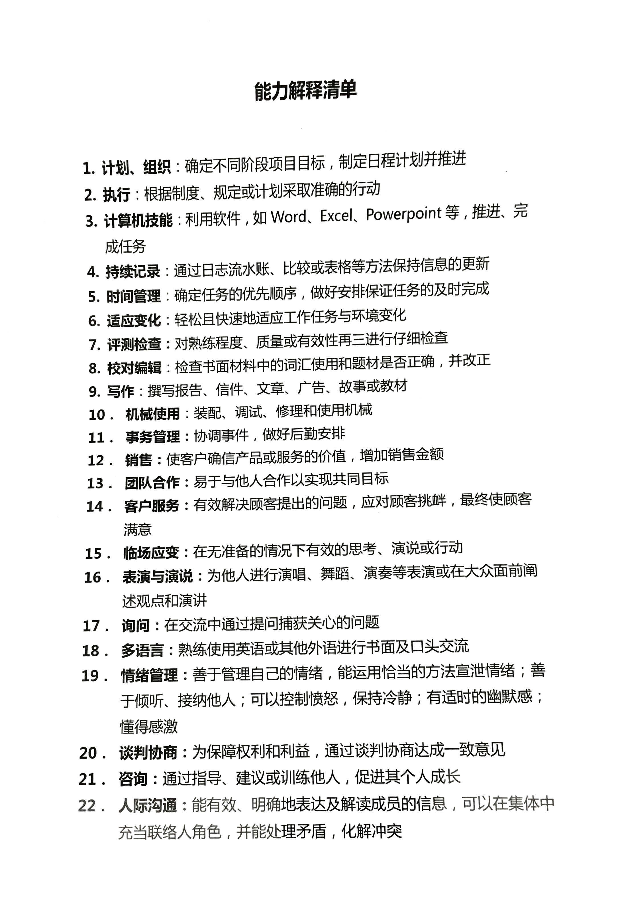
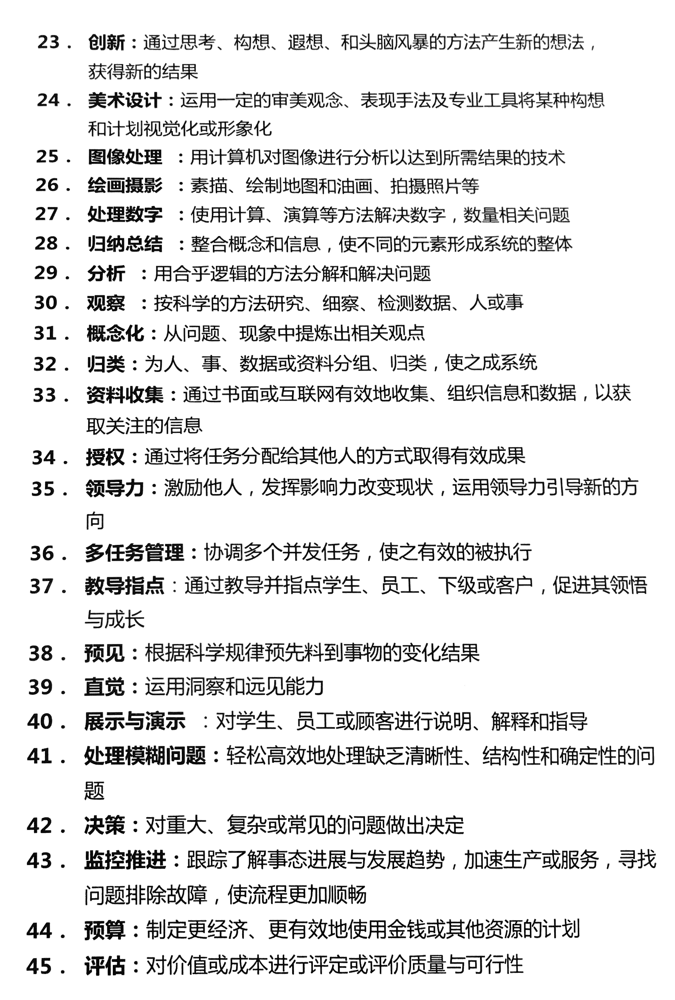

[TOC]

##简介

>讲师介绍: 王鹏
>
>国家认证《生涯规划师》课程培训讲师、国家认证企业培训师、国家生涯规划师课程研发组成员、ACCA青年学员职业生涯规划讲师、中金会特聘职业生涯规划专家、英孚教育特约学员职业生涯发展规划专家。曾有多年人力资源行业从业和管理经历，对大型民企、外企等业绩导向型企业有独道的培训理念和方法，授课风格风趣幽默，言简意赅，直指课程重点，注重力度和效率，案例典型实操性强。

眨眼五月，劳动三天假期都过去了，年中压力又席卷而来。你的年中目标完成的如何了？工作积极性是否有所懈怠？工作遇到瓶颈，有时甚至怀疑自己的工作能力？又是否常常迷茫，不知道工作的意义和价值在哪儿？

如果你有以上症状，那就赶紧加入百度大学为你特别定制的年中大餐——时令绝杀技之《打造你的核心竞争力》。
本次课程是百度大学联合著名企业培训师——王鹏老师带来的时令课程。王鹏老师曾有多年人力资源行业从业和管理经历，服务过国内外多家知名企业。其中与新浪网共同定制了针对新浪130多位中高层管理者的《中高层管理培训——员工成长与发展》；连续4年与“丰田投资”合作开展《员工职业生涯发展》体系搭建；曾为云南最大医药连锁企业“一心堂”全集团中层管理者做《员工职业生涯辅导》培训；连续三年获邀参加“中国职业生涯发展论坛”并在企业分会场做演讲嘉宾。拥有非常丰富的企业培训经验，课程内容深受广大学员好评。


## 第一部分穿越看人生:罗列人生不同阶段压力

### 人生七年纪录片
这个纪录片讲的是几分钟内看完别人的一生。

从一生的维度上来看，某个阶段应该做哪些最有效，做哪些没有效。

**Disclaimer：讲师讲的只是规律而已，人生没有标准答案！**

### 职业生涯的打怪升级
分几个年龄阶段讲解。

18、23、30、37、45

人生重大压力结点：
18考大学
23找工作
30结婚生子
37转型

### 18岁最该做的事情
1. 达到社会平均学历
2. 为未来的工作储备能力

23岁倒推回来：最不该做的事情：提前开启生涯多角色(结婚、生子 etc)

### 23岁最该做的事情
1. 工作，经济和人格的独立->毕业赚钱。

30岁倒推回来：最不该做的事情：啃老、享受人生

### 30岁最该做的事情
1. 工作、婚育->工作有清晰的方向，承担家庭的责任

37岁倒推回来：最不该做的事情：迷茫没方向

达到的状态是：工作的未来的方向不迷茫
得益于23岁-30岁的经济独立，已经能够考虑清楚了工作的方向。

### 37岁最该做的事情
1. 工作、在学习->管理专家

45岁倒推回来：最不该做的事情：放弃学习、坏习惯

这个年龄达到的目标应该是高管、事业部经理etc。
由于坑少人多，所以很多人会开始考虑转型。

回过头来说，如果30岁的这个阶段没有想清楚，37岁就会遇到危机。


```flow
io1=>inputoutput: 大学毕业
io2=>inputoutput: 就业
cond=>condition: 选择专家路线
io3=>inputoutput: 专家岗位
io5=>inputoutput: 行业专家
io6=>inputoutput: 高级管理
io4=>inputoutput: 管理岗位

io1->io2->cond
cond(yes)->io3->io5
cond(no)->io4->io6
```

### 45岁最该做的事情
1. 平衡

生活工作的平衡。下一辈、上一辈、配偶的更年期。
很多咨询者表达的忧虑是：不敢有一丝闪失。

倒推回来：最不该做的是：事业、大病。

### 第一部分总结

核心竞争力的根基：人生的全局观


##  “行企岗”职业发展公式

### 任何一个职业都必须回答一个问题：
我能帮你解决什么问题？

### 岗位的两个核心问题
1. 我能解决的问题对对方来说有多重要
2. 是不是只有我才能解决(稀缺性)


## 能力四象限

| 能力 | 喜欢 |  能力管理  |
|----|----|----|
| O  | O  | 优势 |
| O  | X  | 退路 |
| X  | O  | 潜能 |
| X  | X | 盲区 |
###如何判断自己的能力落在哪一个区域

step1 : 填写如下问卷，将能力词汇填写到象限图片中。

step2: 将工作能用到的词汇用圆圈圈出来。





