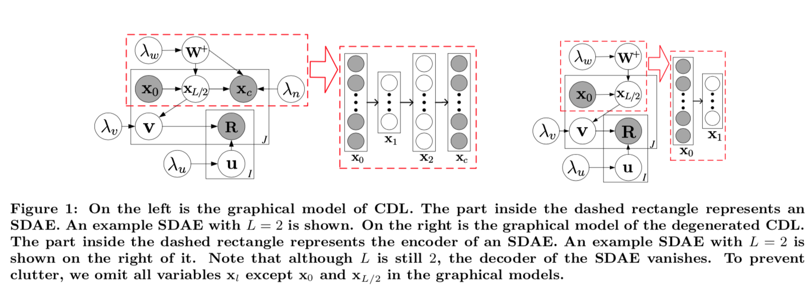
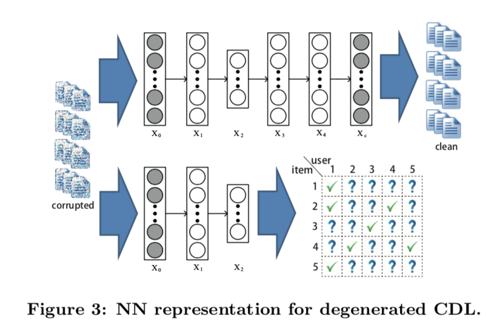

1. 文章背景简介

   2015年的文章，wang hao(王灏)一作。知乎名人、tusimple 科学家 Naiyan Wang二作。作者毕业于交大，现在在MIT。发表文章时在港科大。

2. 这篇文章什么领域的

   RecSys

3. 这篇文章解决什么问题的

   deep learning for Rec system

4. 这篇文章的解决方法表面是什么

   利用多任务框架，通过EncoderDecoder结构，引入外部知识，来学习item特征表达。再利用item-user向量相乘，预测ratings。

  

   

   

5. 这篇文章的解决方法背后的物理意义是什么(Part-1)

   

6. 这篇文章的亮点是什么

   - 首个用层次化Bayesian模型来将深度学习和RecSys联系起来的文章。

7. 这篇文章的缺点是什么

8. 最终效果怎么样

9. 对当前的工作有什么借鉴意义

   - 作者对于很多问题的抽象，值得分析，诸如经过高斯分布初始化SDAE的权重，以及对层输出应用BatchNormalization就能叫做hierarchical bayesian model 的原因是什么。

   - 为什么loss设计是这样的，背后的原理、物理意义、思路是什么？
     $$
     \begin{gather*}
     \boldsymbol{\textit{L}}=-\frac{\lambda_{u}}{2}\sum_{i}\|\bold{u}_i\|{_{2}^{2}}- \frac{\lambda_{w}}{2}\sum_{l}(\|\bold{W}_l\|{_{F}^{2}} + \|\bold{b}_l\|{_{2}^{2}}) \\
     - \frac{\lambda_{v}}{2}\sum_{j}\| \bold{v}_j - f_e(\bold{X}_{0,j*}, \bold{W^+})^T   \|{_{2}^{2}} \\
     - \frac{\lambda_{n}}{2}\sum_{j}\|  f_r(\bold{X}_{0,j*}, \bold{W^+})^T - \bold{X}_{c,j*}   \|{_{2}^{2}}\\
     - \sum_{i,j}\frac{\bold{C}_{ij}}{2} (\bold{R}_{ij}-\bold{u}{_i^T}\bold{v}_j)^2
     \end{gather*}
     $$
     

10. 这篇文章发论文的套路是什么

