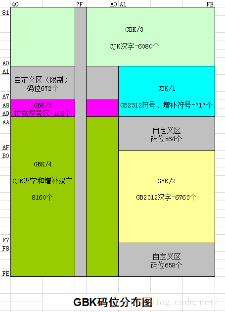

# GBK编码 

[TOC]

## 预备知识

二进制数字

十六进制的 ```0x```


## GBK

### GBK编码表示

GBK的汉字用2个字节表示。前面一个字节叫做高位，后面的一个字节叫做低位。

例如在内存中，汉字```皙```对应的高位字节是```0x95(10010101)```,低位字节是```0x91(10010001)```。

即2字节的汉字```皙```的完整表达为```0x9591```


### GBK编码范围

**GBK编码范围：8140－FEFE**

其代表的含义是高位字节的范围是**81-FE**(129-254)，低位字节的范围是**40-FE**(64-254)。减去```0x[**]7F```这一列不表示任何的汉字，每一个高位可以包含190个汉字。

例如，如下表格摘自GBK规范文档中的开始部分 [^GBK规范],第一个区域(丂-侢)对应的是```8140-81FE```

```
全国信息技术标准化技术委员会
汉字内码扩展规范(GBK)
Chinese Internal Code Specification
1.0 版

（按编码顺序排列）

81 ０ １ ２ ３ ４ ５ ６ ７ ８ ９ Ａ Ｂ Ｃ Ｄ Ｅ Ｆ
４ 丂 丄 丅 丆 丏 丒 丗 丟 丠 両 丣 並 丩 丮 丯 丱
５ 丳 丵 丷 丼 乀 乁 乂 乄 乆 乊 乑 乕 乗 乚 乛 乢
６ 乣 乤 乥 乧 乨 乪 乫 乬 乭 乮 乯 乲 乴 乵 乶 乷
７ 乸 乹 乺 乻 乼 乽 乿 亀 亁 亂 亃 亄 亅 亇 亊
８ 亐 亖 亗 亙 亜 亝 亞 亣 亪 亯 亰 亱 亴 亶 亷 亸
９ 亹 亼 亽 亾 仈 仌 仏 仐 仒 仚 仛 仜 仠 仢 仦 仧
Ａ 仩 仭 仮 仯 仱 仴 仸 仹 仺 仼 仾 伀 伂 伃 伄 伅
Ｂ 伆 伇 伈 伋 伌 伒 伓 伔 伕 伖 伜 伝 伡 伣 伨 伩
Ｃ 伬 伭 伮 伱 伳 伵 伷 伹 伻 伾 伿 佀 佁 佂 佄 佅
Ｄ 佇 佈 佉 佊 佋 佌 佒 佔 佖 佡 佢 佦 佨 佪 佫 佭
Ｅ 佮 佱 佲 併 佷 佸 佹 佺 佽 侀 侁 侂 侅 來 侇 侊
Ｆ 侌 侎 侐 侒 侓 侕 侖 侘 侙 侚 侜 侞 侟 価 侢

82 ０ １ ２ ３ ４ ５ ６ ７ ８ ９ Ａ Ｂ Ｃ Ｄ Ｅ Ｆ
４ 侤 侫 侭 侰 侱 侲 侳 侴 侶 侷 侸 侹 侺 侻 侼 侽
５ 侾 俀 俁 係 俆 俇 俈 俉 俋 俌 俍 俒 俓 俔 俕 俖
６ 俙 俛 俠 俢 俤 俥 俧 俫 俬 俰 俲 俴 俵 俶 俷 俹
７ 俻 俼 俽 俿 倀 倁 倂 倃 倄 倅 倆 倇 倈 倉 倊
８ 個 倎 倐 們 倓 倕 倖 倗 倛 倝 倞 倠 倢 倣 値 倧
９ 倫 倯 倰 倱 倲 倳 倴 倵 倶 倷 倸 倹 倻 倽 倿 偀
Ａ 偁 偂 偄 偅 偆 偉 偊 偋 偍 偐 偑 偒 偓 偔 偖 偗
Ｂ 偘 偙 偛 偝 偞 偟 偠 偡 偢 偣 偤 偦 偧 偨 偩 偪
Ｃ 偫 偭 偮 偯 偰 偱 偲 偳 側 偵 偸 偹 偺 偼 偽 傁
Ｄ 傂 傃 傄 傆 傇 傉 傊 傋 傌 傎 傏 傐 傑 傒 傓 傔
Ｅ 傕 傖 傗 傘 備 傚 傛 傜 傝 傞 傟 傠 傡 傢 傤 傦
Ｆ 傪 傫 傭 傮 傯 傰 傱 傳 傴 債 傶 傷 傸 傹 傼

```


还有一个比较形象的码位分布图[^GBK分布图]:




## 除此之外

###宽字符

[宽字符]: https://blog.csdn.net/daliang126/article/details/53584395

宽字符 wchar_t，在win32 中，wchar_t为16位（编码是UCS-2BE）；Linux中是32位（编码是UTF-32BE，等价于UCS-4B）。

```const wchar_t* ws = L"中文abc";``` 的编码分别为：

```0x4E2D 0x6587 0x0061 0x0062 0x0063 //win32，16位```

```0x00004E2D 0x00006587 0x00000061 0x00000062 0x00000063 //Linux，32位```

 

### 双字节表达导致正则匹配时的歧义

由于GBK汉字是用两个字节进行表达，那很有可能在正则匹配时，导致两个紧邻的汉字被识别匹配到一个新词。

例如下面的python代码为例，```憰==\x91\x95``` ```憪==\x91\x90```,两个字紧邻就形成了```憰憪==\x91\x95\x91\x90```,

假如我有一个正则式，恰好是匹配```皙==\x95\x91```字，那就会导致，匹配的结果会意外的匹配成功。

```python
In [1]: import re

In [2]: reg_pat = '\x95\x91'

In [3]: print(reg_pat.decode('gbk'))
晳

In [4]: query = '\x91\x95\x91\x90'

In [5]: print(query.decode('gbk'))
憰憪

In [6]: print(re.findall(reg_pat, query)[0].decode('gbk')) #'晳'的gbk表达恰好在'憰憪'中, 会被匹配到
晳
```


不过，比较有意思的是，这种现象不会在C++的Boost正则库中出现。

```c++
TEST_F(NovaReMatchTest, TestRegexGBK) {
    // 憰 = 0x 9195
    // 憰 = 0x 9190
    // 皙 = 0x 9591
    std::string expression = utf8_to_gbk("(皙)");

    boost::regex pattern = boost::regex(expression);

    std::string q = utf8_to_gbk("憰憪");

    boost::smatch what;
    boost::regex_search(q, what, pattern, boost::match_extra);
    std::vector<std::string> captures;
    get_captures(what, captures);
    for (int i = 0; i < captures.size(); i++) {
        TRACE_LOG("captures : [%s]", captures[i].c_str());
    }
}

// Output:TRACE: [TestBody] captures : []
// Output:TRACE: [TestBody] captures : []
```


## 资源

- 汉字字符集编码查询: https://www.qqxiuzi.cn/bianma/zifuji.php
- 在线进制转换: http://tool.oschina.net/hexconvert/

## 引用

[GBK规范]: https://www.qqxiuzi.cn/zh/hanzi-gbk-bianma.php	"规范"


[GBK分布图]: https://blog.csdn.net/u010189459/article/details/46792115

