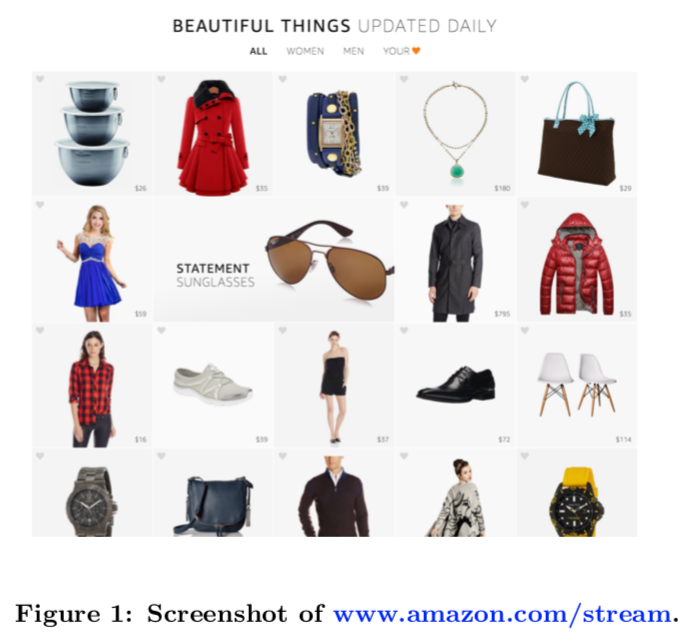

# Adaptive, personalized diversity for visual discovery

1. 文章背景简介

   2016年的文章。RecSys2016的Best, paper，作者来自Amazon。

2. 这篇文章什么领域的
   推荐系统。

3. 这篇文章解决什么问题的

   在信息瀑布的模式下，能够实时的、个性化的推荐用户商品，并且提高CTR。

   

4. 这篇文章的解决方法表面是什么

   文章分为三步走的方式

   - 打分模块，将商品按照分数排序获得候选。

     首先用**Probit Regression**对商品的属性和click的概率进行建模，得到$P(click | item\  is\  viewed) $。

     当然，有一些流行的商品可能会获得大量的曝光，有一些商品获得不了曝光。这样就会导致有一些商品一直没有办法被打分。为了避免这种问题，就需要有一种exploit-explore机制。本文用的是**Thompson sampling**方法决定何时exploit，何时explore。

   - 多样性评估模块，避免了一个屏幕内推荐的商品都是同一类的枯燥情况出现。

     为了保证展现数据的多样性，提升用户体验，在打分模块的基础上，还增加了另一个模块来对候选多样性进行打分，选取总分数最大的$k$个商品进行展示。

     假设商品$i$的特征向量是$\bold{a}_i$, 则这$k$个商品的特征向量为$\sum_{\bold{a}_i \in A_k}\bold{a}_i$，利用这份特征向量计算多样性打分，与第一部得到的分数相加，得到商品的多样性模块输出分值。

   - 个性化模块，根据用户的点击数据更新商品的权重，影响打分模块

     作者利用用户的点击数据来更新每一个特征的权重$\hat{\bold{w}}=(\bold{c_u}+\bold{\alpha_0})\|\bold{c_u}+\alpha_0\|_{1}^{-1}$。其中，$\alpha_0$可以人工拍，也可以在业务系统中统计出来。$\alpha_0$可以控制权重$\bold{w_u}$的分布，也就是其分布的参数($Dirichlet$分布)，$\bold{c}_u$是在参数$\bold{w_u}$下点击概率的分布($Multinomial$分布)。

     得到了用户相关的$\bold{w}$就可以代入计算第二个模块中去影响打分了。

5. 这篇文章的解决方法背后的物理意义是什么

   作者认为用户的行为以及背后的偏好，都是一种概率分布。在这种思想下，作者不仅将用户的click行为进行了概率建模，click模型的参数进行了建模($Dirichlet$的思想)。

   通过比较完善的建模，将点击行为、商品属性、用户偏好都纳入进来对商品进行打分排序。

6. 这篇文章的亮点是什么

   一种新的推荐界面下的推荐方法

7. 这篇文章的缺点是什么

   更新特征权重的方式有些粗暴，似乎可以做的更好一些。

8. 最终效果怎么样

   评估效果分为3个维度进行：用户时长、浏览数量、CTR。

9. 对当前的工作有什么借鉴意义
   

10. 这篇文章发论文的套路是什么

