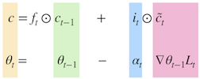
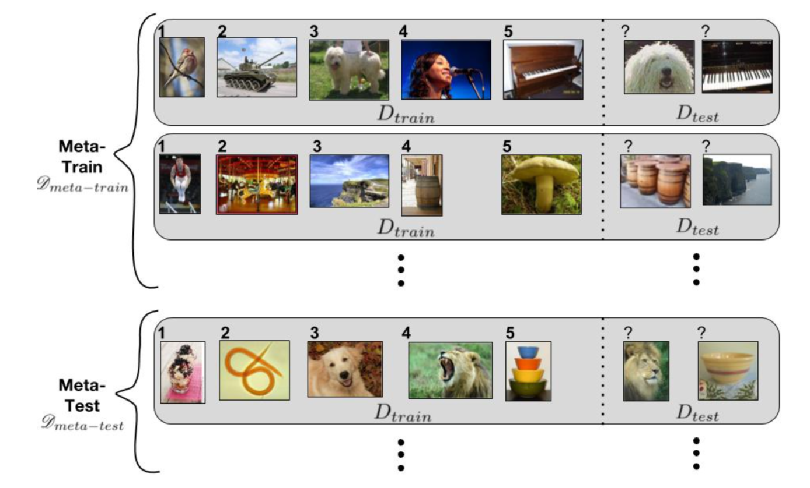

# Optimization As A Model For Few-shot Learning

1. 文章背景简介

   Twitter的文章。发表在ICLR 2017会议上。

2. 这篇文章什么领域的

   $Meta-Learning$，元学习。
   所谓的元学习，由两部分组成

   - 能够存储通用知识的模块$M(meta-learner)$

   - 能够快速通过几个样本训练得到的分类器模块$C(base-learner)$

   而两个模块配合的方式为$M$可以生成分类器$F$的参数。

3. 这篇文章解决什么问题的

    $Few-shot$情况下训练一个好的分类器的问题。

4. 这篇文章的解决方法表面是什么
   用$LSTM$作为$M$,生成$F$的训练器参数。

5. 这篇文章的解决方法背后的物理意义是什么

   $LSTM$中有一个重要的概念是$cell$,其状态可以用向量$c$来表示，随着timestep的迭代，其更新的公式为$c=f_t\odot c_{t-1} + i_t \odot \tilde{c_t}$

   其中$f$属于遗忘系数，控制着遗忘多少上一个timestep细胞的状态。$i$属于记忆系数，控制着本次细胞状态的权重。

   在本文的few-shot语境下，因为$base-learner$的参数更新机制为$\theta_t=\theta_{t-1}-\alpha_t\nabla\theta_{t-1}L_t$

   和$c$的更新机制太像了。索性就把$\theta_t$的生成套到$LSTM$的公式里面了：其中同样颜色的字母代表公式中同等地位的部分：

   

   这样$M$专注于学习$f_t$和$i_t$就可以了。

   具体的学习过程可以先看一下输入数据：

   

   这里面切记，以第一行为例，每一个baselearner领到了$meta-learner$分配的初始参数$w_0$之后，是由左至右,由$1\to\  t$即$1\to5$顺序进行的。每一个step完成后，向$meta-learning$汇报，再领取下一个step的参数$w_1$,以此类推。直到走到虚线右边，用$D_{test}$获取$meta-learner$的$loss$，更新$meta-learner$。

   用这样的方式训练一个记忆着通用信息的如同大脑般的$meta-learner$。

   这样，假设说我现在训练好了一个牛叉的meta-learner，明天想应急上线识别5个人脸： 林志玲、周杰伦、桂纶镁 、李彦宏、马云， 这五个人， 我收集5张照片， 通过meta-learner过一次这5张图片，就能得到一个识别这5个人的base-learner，明天就能上线了。 

   

6. 这篇文章的亮点是什么

   将meta-learning用LSTM的思想建模，上一个时序的任务信息带到当前时序继续学习。

7. 这篇文章的缺点是什么

   如果没有meta-learning的基础的话，很多表达比较让人费解。应该在多介绍一下meta-learning的在related search里面或者introduction里面。

8. 最终效果怎么样

9. 对当前的工作有什么借鉴意义

   明白了meta-learning是什么

10. 这篇文章发论文的套路是什么

   用一个经典的思想，改造整个网络架构，清晰、简洁，有创新。

