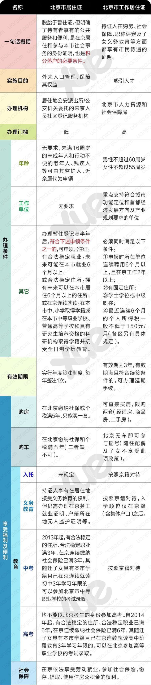
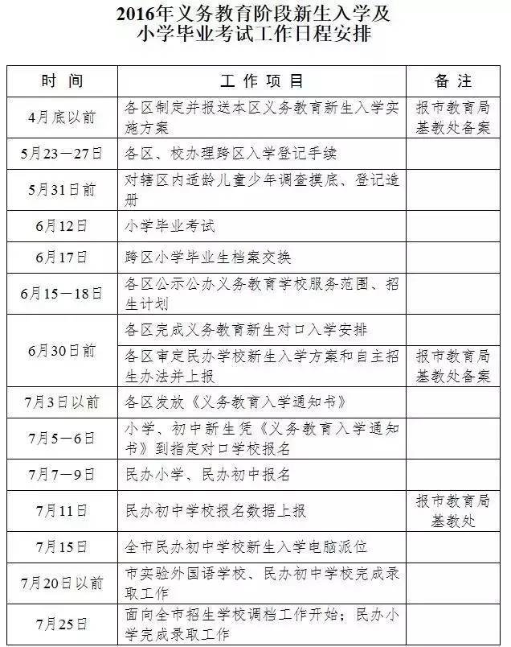
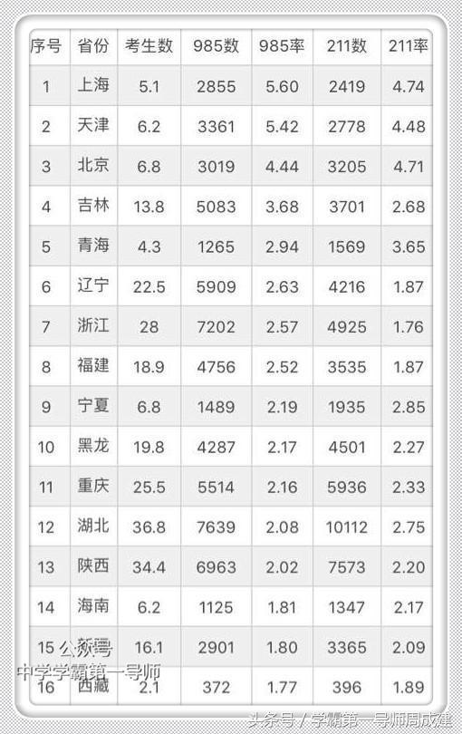
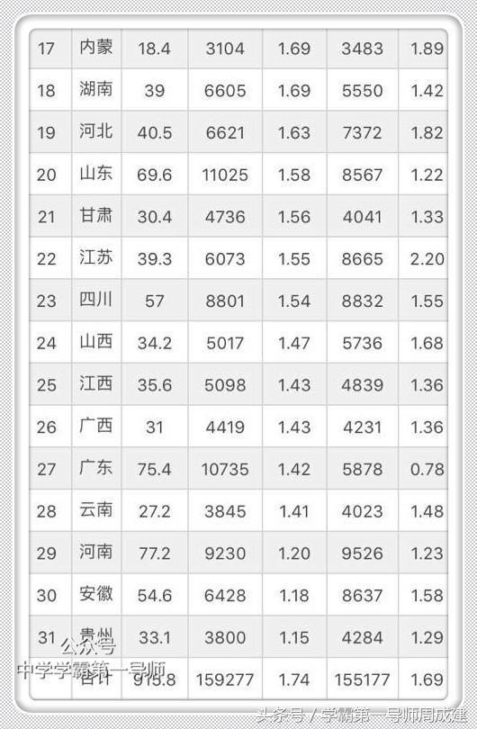

[TOC]

## 教育目标
1. 开心快乐的成长
2. 有效的成长，有专长、有知识量的成长
3. 有自主独立能力，有规划能力

## 教育考量的因素
### 同学氛围
一个好的集体可以促进小孩互相学习，互相进步。
### 师资力量
好的老师能够发掘学生的有点。会以学生都是天真的璞玉作为前提，和学生进行交流，不会把学生分为三六九等。
学生时代，学生要能够感受到来自教师的公平。
教师要有教育经验、掌握科学的教育原理和教育方法。

### 升学难易程度调研

### 城市给小孩见识的机会
### 城市的生态环境
## 公立教育

公立学校是由政府财政拨款。一般而言，公立学校的数量和办学规模都远远超过私立学校，而且，学习费用相对较低，教学设施较为完善。不仅如此，有些国家的公立学校提供免学费教育，如德国、瑞典、意大利、法国等国家。但公立大学入学门槛较高，申请竞争较为激烈，只有那些学习成绩特别优秀的申请人，才能获得费用低廉、高质量的教育机会。

## 私立教育

## 公里vs私立

### 公办学校和私立学校有什么区别？

> **答：公办学校和私立校的区别有以下几个方面：**
>
> 1.资金来源不同：公立学校的资金是由国家拨款；私立学校的资金是办学投资者私人投入加上高额学费（经物价局核定的标准）。
>
> 2.师资稳定性不同：公立学校的师资由于是有编制的所以相对稳定；私立学校的师资流动性大，哪里待遇好，就到哪里去。
>
> 3.硬件设施保障不同：现在，提倡教育资源均衡，公立学校各个学校的硬件设施都不会有太大的差距，其实每个学校硬件环境都会有所不同，民办学校的环境一般比公办学校好。
>
> 4.学生来源不同：公立学校的学生就近入学，一般读“通学”（走读）；私立学校学生来自四面八方，五花八门的有经济实力的不同层次的家庭，学生一般是住校，实行"封闭式管理。学校心理教育跟不上，孩子心理容易失去平衡，最容易出现如早恋，攀比等不良现象。
>
> 5.入口出口不同：民办学校一般有钱，想进就能进；公立学校跨区交钱也困难，统考，中考等，公立学校高，多数私立学校较低。其实从以上公办学校与民办学校的区别从某种程度上已经分析了公办小学与民办小学的优势与劣势，最后总结一下，由于民办学校的办学性质可以看出学校是自负盈亏，学校的发展是系关己命的问题，只有把学校办好，它才不至于亏损，这就调动了办学的积极性。民办学校会自己吸纳一批稳定的教师队伍，同时又高薪聘用一些名校的专家，教授，优中选优，以提高学校的教学质量和知名度。
>
> 从一定程度上来说，民办学校会比公立学校更看重升学率，因为他们就是靠这个吃饭的，没升学率就没名气，没名气就不会有学生。但更多的民办学校又同时打着素质教育的招牌，他们这应该可以算是两手抓的政策。劣势就是学校对孩子的学习成绩会抓的相对比较紧，孩子的压力也可想而知，另外学费比较高。但是民办学校的劣势恰恰是公办学校的优势，关于公办学校的优势劣势小编在此也不想多说了，相信各位家长已有所明白。

### 非京籍孩子能上私立学校吗?

> 答：非京籍孩子可以上北京私立学校的，但需家长按照区教委要求办理相关证件，同时按照学校招生要求进行报名。
>
> 北京部分优质民办学校成为近些年来非京籍及京籍家长的首选，选择民办校不仅仅可以进入强区，而且未来小升初的去向明朗，这些都是幼升小家长择校参照之一，特别是对于北京教育低洼地段来说，小升初去向好，教学实力强，同时还位于教育强区那必然是家长选择一所好学校的理由。

### 非京籍上民办学校需要办理五证吗?

> 答：北京知名的民办学校是需要办理五证的，家长可按照本区教委要求办理五证，按照往年家长分享的信息，一般民办校稍微放宽的是，五证可在其他区审核通过，也就是说你想去海淀上民办校，可以在丰台区、房山区审核通过五证，按照学校要求报名，招生符合通过后可带齐证件前往学校报道。

### 私立学校到底有没有学籍?

> 答：家长选择正规的民办学校是有学籍的，建议家长在择校之前，首先要对这所学校有了解，比如学校的教学形式、师资情况、学生的学籍、小升初的去向、中高考的情况等，这些都是关系到孩子未来的教育。

### 私立学校什么时候招生？需要准备什么？

> 答：私立学校可以跨区可提前招生，所以北京很多私立学校一般在每年的一月份就发布招生简章。但是，这不是说民办小学会提前很久招生，很多民办学校的招生工作会持续很久。根据北京市义务教育入学信息系统公示，一般民办校会在每年的6月初完成招生工作。对于很多非京籍的家长来说，五证审核的日期是在五月进行，六月初就可以知道五证是否通过审核。如果没有通过审核可以报考民办小学。在这里小编需要提醒各位家长的是：很多热门的民办小学学位紧张，一定要提前报名。而且与公办小学免试就近重视划片的入学原则不同，一些热门的民办小学如建华等是有入学考试的，如果家长以这些学校为目标学校，一定要提前对孩子进行入学考试的培训。

### 怎样选择一个好的私立学校？

> 答：首先，选择的学校最好是在教育部有备案的学校，这样的学校一般都是正规的私立学校，师资力量、教育水平等较为稳定。其次，可以看学校的硬件设施、学校环境、家长评价以及学校往年的升学情况。

### 附：家长对公立私立学校的评价

> **家长一：**民办老师和公办老师差不多。9年义务制教育下，民办要学费，公办不要学费,教学质量好，师资好，公办的不能挑学生，划给你就必须收，有很多差生、捣蛋鬼。民办的可以踢出不好的，只保留好的。高中阶段，因为不是义务制，公办的也可以拒收差生，本来公办实力强，所以公办的高中比民办的好。
>
> **家长二：**吸取小学的教训，初中上了公办的特色班。不过，当初选择的时候，还是犹疑了好长时间。因为，大家都说民办好。但最终促使我让小孩上公办，就是担心民办的教师队伍不稳定。
>
> **家长三：**民办的没有地段生或地段生很少，大都是考进来的，水平整齐，中考成绩较好－－这样好学生越来越愿意考进去，生源越来越好，良性循环；公办有地段生（甚至占大头），水平参差不齐，中考总体成绩没法和好的民办去比，而且校风也有影响。
>
> **家长四：**现在非常有名的民办，可能是规模扩大后没及时找到好老师的缘故，搞后勤的老师当了数学老师，一年后重新回去搞后勤，4、5年级的班主任，是从外校引进的，也没觉得特别好.总之，关键是民办有个好机制，给好学生营造了一个好环境。好机制吸引好人才，没有好机制，好生源无从谈起。
>
> **家长五：**民办的学习氛围好,中考政策多变，所以我们的小孩要练好基本功，书是读在自己肚子里的，只要成绩好，不管政策怎么变都不怕。我选民办的还有一个主要原因是，民办的家长都愿意为孩子花精力，风气好。公办的，即使好班，也未必如此。
>
> **家长六：**民办是希望，公办是保底。虽然还没到升初的时候，但是一路私立的过来，我个人的感觉是：民办的老师不一定水平更高，但更花心思；公办的老师水平不一定低，但留有余地。民办的家长更努力，学生的竞争更激烈；公办的家长和学生水平都参差不齐。而且现在教育产业化，经济实力决定了很多东西。

老大的性格属于乖巧、文静型，初入学校她很快的适应了这种一成不变的应试教育。作业干净、字迹工整、坐姿挺拔，成绩也很不错，属于老师眼里的那种好孩子。但不久我就发现了一个小问题，她不快乐，她不享受在学校的时光，因为学校的严格管理，她甚至变得有些压抑。比如她会要求我来做小学生而她做老师，在授课的过程中她会对我异常严厉的“管教”，再比如她会找很多借口请病假，一点点的小病也要休息，像及了一场大逃亡。

但让我真正离开的“原动力”都不是这些，而是始于老师对我的一次家长约谈。老大的英语属于公立学校里非常不错的孩子，她的阅读无论是中文还是英文都开始的很早，而且阅读面非常的广。这当然跟公立还是私立无关，阅读是一个家庭的习惯。英语老师约谈我的主要原因是：孩子的英文作业完成的不好。老师认为一个单词不写够一定的数量，就不能达到滚瓜烂熟的地步。孩子可能只达到了老师要求一半的量，她认为自己已经记劳了单词，没有必要再浪费时间写下去。当然，我很支持孩子的想法，学习的过程没有必要标准化。对于学习的方法，我不想多言，从来通向罗马的就不是一条路。这件事情我不能理解的是，老师面对不同程度孩子不能灵活处理，标准化到了教条的程度。这也是公立学校的大多数问题，过量的学生，过少的师资配比，老师没有过多的精力和时间对不同情况的孩子区别对待，也就跟别奢望用颜悦色来照顾每一个孩子的情绪。

我们为老大选择了一所中西合璧的私立学校，整个教育西化，但并不完全放弃母语。经过短暂的语言过渡，我惊喜的发现她如鱼得水。私立学校一般选择国际课程，而一般的国际课程淘汰率非常高，孩子学习的知识面非常的庞杂，多听、多看、多接触、多实践、多调查、多研究，故而形成自己的体验和经历，这过程真美好。

### 私立的国际学校课程设计

众所周知，国际课程体系就三种：**美国AP，英国A-Level，世界性的IB。**

（美国AP课程课本）

想考牛津剑桥，可选A-Level（英国第五名之后的学校，其实都不要求A-level成绩了）；想去美国上大学，可选AP。

A-level是一套严谨的高中教学体系，而AP不是体系，只是高中时修几门大学课程而已。AP的好处是，在美国上大学之后，读的AP越多越省时省钱，能免除多达一两年的课，而一年学费+生活费=四五十万呢。

（美国学生平均在AP每个科目，每天投入的学习时间）

**最牛逼的体系当然是IB，全中国最顶级的国际校，都有IB资质。**IB因为从整个课程设计上就强调学术研究能力，连数理学科都需要做论文，是更讲究深培养、重能力的课程。

几位在南方办国际校的朋友告诉我，IB资质非常难拿，筛选性很大，稍微差一点都拿不到。因此米粒妈建议，**大部分没有IB资质的学校就不要考虑了，基本都是为了赚钱。**

北京知名的顺义国际学校、鼎石、世青、京西、德威等都是IB体系，上海知名的世外、包玉刚、平和等也都是IB体系。

## 当今国家政策

###工作居住证

### 常见的划分小区的方法
1. 学校划片
2. 在学区范围内计算机派位（登记）入学
3. 自愿原则对口直升一般初中。
### 和教育相关的制定部门
教育部
北京市教委
教育法律由全国人大或常委会制定，教育行政法规由国务院制定，部门规章由教育部制定，地方性教育法规由省级立法机关及政府制定。

### 和教育相关的法律法规
1.北京

小学、初中坚持免试就近入学
　　凡年满6周岁（2012年8月31日以前出生）的本市户籍适龄儿童都要参加学龄人口信息采集，免试就近入学。
首次出台本市户籍无房家庭在租住地入学办法
首次在小学入学政策中规定，本市户籍无房家庭，长期在非户籍所在区工作、居住，符合在同一区连续单独承租并实际居住3年以上且在住房租赁监管平台登记备案、夫妻一方在该区合法稳定就业3年以上等条件的，其适龄子女可在该区接受义务教育。
区教委要联合相关部门共同审核入学资格。特别是对本市户籍无房家庭、合法稳定工作、实际居住等条件的审核，重点对过道房、车库房、空挂户等情况进行核查，凡不符合实际居住等条件的，均不得作为入学资格条件。
同时，将依托北京市住房租赁监管平台核验本市户籍无房家庭住房租赁登记备案信息，租赁信息核验自5月7日与入学信息采集工作同步启动

1. 11月7日，第十二届全国人民代表大会常务委员会第二十四次会议审议通过了《关于修改\<中华人民共和国民办教育促进法\>的决定》，民办学校的举办者可以自主选择设立非营利性或者营利性民办学校，但是不得设立实施义务教育的营利性民办学校，修正案自2017年9月1日起施行。
2. 12月19日，教育部网站发布《教育部等11部门关于推进中小学生研学旅行的意见》，表示各地要把研学旅行摆在更加重要的位置，推动研学旅行健康快速发展。《意见》还指出，中小学生研学旅行是由教育部门和学校有计划地组织安排，通过集体旅行、集中食宿方式开展的研究性学习和旅行体验相结合的校外教育活动，要将研学旅行纳入中小学教育教学计划，加强研学旅行基地建设，规范研学旅行组织管理。
3. 社区教育
4. 国务院：重点发展教育与培训等新兴服务业，加强科技教育。
  8月8日，国务院发布《“十三五”国家科技创新规划》，提出要将智能交互等新一代信息技术应用于发展教育与培训等新兴服务业。《规划》明确提出青少年的科技教育，巩固农村义务教育普及成果，提高农村中小学科技教育质量，为农村青少年提供更多接受科技教育和参加科普活动的机会。以培养劳动技能为主，加强中等职业学校科技教育，推动科技教育与创新创业实践进课堂进教材。完善高等教育阶段的科技教育，支持在校大学生开展创新性实验、创业训练和创业实践项目。
### 幼升小的常见政策

**2018年北京幼儿园入园准备时间表**

　　**三月份**

　　1.锁定目标园，最少一个一个保底。

　　2.确认这些园去年的具体报名流程、准备好入园材料、费用。如果目标里有私立园，预约到园里看看。

　　3.关注孩子思维能力发展，例如观察能力、表达能力等。部分幼儿园有入园面试，做好准备。

　　4.调整一下孩子的作息，开始关注孩子的入园能力，比如，独立喝水、吃饭、上厕所的能力和习惯。

　　**四月份**

　　1.刷目标园的官网——如果该园靠自家网站收简历。

　　2.刷各区幼儿园入园信采平台——如果目标园从信采平台收简历，比如海淀、西城、朝阳、顺义等。

　　注意，有的区不用信采招生(比如东城、丰台、石景山)，而是开园后9月份录入一次信息。

　　所以，了解往年信息时，别搞错了。

　　3.刷幼儿园大门，如果该园没有任何网上收简历的历史。

　　**五月份**

　　1.幼儿园报名的第一个高峰。

　　2.中旬通知，下旬开始登录录入。

　　**六月份**

　　1.幼儿园报名的第二个高峰。

　　2.幼儿园完成审核、通知体检的月份。时间集中在中下旬。

　　3.审核时分带不带孩子，具体情况咨询相应幼儿园。

　　**七月份**

　　1.体检，递交健康证明。

　　2.拿入园通知，缴费。

　　3.入园适应能力培养。

　　**八月份**

　　开园家长会。

　　**九月份**

　　1.关注孩子的身体和情绪。

　　2.加入所有能和老师交流上的工具：手机、微信、qq。

### 小升出的常见政策
昌平区“幼升小”入学将采取单校划片和多校划片相结合
日前，昌平区发布2018年义务教育阶段入学政策，在“幼升小”入学方面，昌平区教委根据学位供给情况和户籍、房产、居住年限等因素，采取单校划片和多校划片相结合的方式划定学校服务片区，并开展学区制和九年一贯制对口招生。
政策中还指出，本市非昌无房家庭，长期在昌平区工作、居住，符合在本区连续单独承租并实际居住3年以上，且在住房租赁监管平台登记备案，夫妻一方在本区合法稳定就业3年以上等条件的，其适龄子女可在本区接受义务教育。
同时，政策中提出将推行部门联动审核，区教委及所属学校联合属地镇政府（街道办事处）、区住房城乡建设部门、区规划国土部门，公安派出所、村民委员会（居民委员会）共同审核入学资格。特别是对本市户籍无房家庭、合法稳定工作、实际居住等条件的审核，重点对过道房、车库房、空挂户等情况进行核查，凡不符合实际居住条件的，均不得作为入学资格条件。
在小升初方面，政策中明确提出，完成小学教育的学生应当进入初中继续接受并完成义务教育。区教委根据适龄学生人数、学校分布、学校规模等因素，按照相对就近原则，合理划定初中学校服务范围。对登记人数少于招生人数的初中，学生就近登记入学；对登记人数超过招生人数的初中，在区域内派位入学，确保每名小学毕业生免试就近升入初中。
招生过程统一使用北京市义务教育入学服务系统，全程记录每名学生入学途径和方式，由各相关部门依据权限进行查询和监控。区教委对全区学校招生工作进行指导、监督和检查，各镇政府（街道办事处）依据职责配合区教委组织和督促适龄儿童少年在新学年开学时入校就读，防止义务教育阶段学生失学或辍学。文/北京青年报记者武文娟

### 出升高的常见政策
### 户口
### 不动产
## 教育的公平与不公
## 国家未来政策的预测
### 北京
逐步降低公办校寄宿生数量和比例
2019年取消各类特长生招生

## 国内重点城市的优劣分析
### 一本率
北京一本率是百分之25，上海是百分之21，你们猜猜江苏是多少？百分之9！比海南还低！

一本率有一个问题：由于扩招、伪一本等原因，省一本率每年会漂浮不定。但是相比之下，985、211率比较稳定，更有参考价值。

### 北京

公立学校排行

| 小学            | 牛逼程度           |
| --------------- | ------------------ |
| 1.北京实验二小; | 西城区一流一类小学 |
| 2.育民小学;     | 西城区一流一类小学 |
| 3.育翔小学;     | 西城区一流一类小学 |
| 4.西师附小;     | 西城区一流一类小学 |
| 5.三里河三小    | 西城区一流一类小学 |
| 1.五路通小学;   | 西城区一流二类小学 |
| 2.北京小学本部; | 西城区一流二类小学 |
| 3.宏庙小学;     | 西城区一流二类小学 |
| 4.北京实验一小; | 西城区一流二类小学 |
| 5.奋斗小学;     | 西城区一流二类小学 |
| 6.黄城根小学;   | 西城区一流二类小学 |
| 7.中古友谊情    | 西城区一流二类小学 |

说完西城区的义务教育阶段的整体情况，我们再来看看西城区学区间的教育实力。西城区之中最好的是德胜学区，基本上也是可能是全国最好的教育资源区域了，每年这个学区考上北京市重点学校的比例能达到83.76%，大部分考上的都是西城区学校，含金量极高。

另外，一个特别重要的建议：不要在金融街学区买房子，并不是因为，这里的房子贵，而是金融街汇聚了全中国最有权势的家庭子弟，这些子弟占用了大量教育资源，不需要买房子也可以上学。

金融街的学区房在12万左右，最后可能只能去上159中学或者鲁迅中学两所普高，性价比不高。西城也有教育资源相对比较薄弱的学区，比如大栅栏，椿树和天桥学区。总体来讲，西城区的教育资源比较平均，选择区域比选择学校来的实际。

海淀区

海淀区被称为北京基础教育的丘陵地带，丘陵嘛，有高有低，可能有泰山，也可能是低洼，整体而言，海淀的口碑还不错，教育质量还可以：一本率通过率56%，三本通过率83%。

首先通过几个数据来了解一下海淀区的整体教育水平：

21所市级示范幼儿园，44所小学素质教育优质校，21所市区级高中示范校，所以说海淀区的教育是丘陵地带，平均高度还是有的。

九年一贯制学校和十二年一贯制学校相对来说比较多：

**小编说：**

北京幼升小网小编猜想，海淀区一贯制学校不算少，学习压力应该没有那么大才对，但是小朋友怎么都这么努力呢?

据了解，海淀的教育抓得比较紧，孩子学习较紧张，学习也包括各种课外活动。

如果选择让孩子在海淀区上学，有几个地方需要注意：

第一，需要拼体力，我是指孩子的体力。

第二，孩子可能整个小学期间出不了教室，学生多，空间小，无法保证安全。

第三，近视的孩子会比较多。

第四，学生水平参差不齐，老师偏爱程度不一。

说海淀区该来看看东城区的情况了。

东城区

东城区是全市教育的平原地带，尖端教育比较一般，每年考上清华北大50人左右，一本率61%，三本率92%，最好的中学是二中，五中，汇文中学，171中学，东直门，166中学和景山学校(实验班比较优秀)，其中有11%的孩子考不上东城的高中。

东城区现在在推行盟—带—贯改革，我们来看下什么是盟—带—贯：

针对“贯”，北京幼升小网这边有一项数据表格，其实就是九年一贯制和十二年一贯制学校名单，分享给大家，仅供参考：

从表格中可以看出东城区一贯制学校并不多，所以东城区在小学的对口直升校和一贯制学校还需下功夫。

关于优质学校，东城区一流一类、二类学校相对来说要少一些，共9所：

**东城区一流一类小学顺序排名(共3所)：**

1.府学小学;

2.史家小学;

3.景山学校

**东城区一流二类小学顺序排名(共6所)**

1.光明小学;

2.汇文第一小学(原丁香小学);

3.和平里九小;

4.和平里四小;

5.黑芝麻胡同小学;

6.一师附小

**附：请点击查看：**

东城区的小学平均水平比较高，师资没有什么差别，生源显得比较重要，有些是打工子弟学校，而有些学校北京人多一些，看个人选择。

朝阳区

朝阳区是北京市四大城区教育的低洼地带，每年考上清华北大20个人以内，一本率50.56%，三本率91.82%。

朝阳区的状况形象的说就是一个字——“多”，人多：白领多，务工人员多，穷人多，当然有钱人也多。

但是朝阳区的好学校实在太少!与京城第一区的位置实在是不相配。说来也奇怪，朝阳区能建全国最牛的CBD，却建不了一所全北京最好的学校。朝阳区外来人口占比53.83%，外来生源70%左右，在中考的时候有24%的孩子考不上本区的学校。

最好的几个中学是80中，朝阳外国语，人大附中朝阳分校，但最好的80中也只在全市排18名。初中方面，陈经纶珠江帝景分校是最好的，陈经纶嘉铭分校，朝阳外国语也都不错，但和西城海淀都有一定差距。

整个朝阳区内也分很多小的学区，其中望京和安贞两个分区是教育资源好的地方。在朝阳区推荐选择九年一贯制的学校，也就是点对点的学校，其中人大附中朝阳学校，小学可以直升初中，然后升高中，实行15年制。

但是人大附中朝阳学校不是人大附中的嫡系，人大附中朝阳分校才是嫡系，但其小学是公立，而初中和高中是私立，不能直升，看好朝阳分校私立学校未来的发展。

两个学校的学区房房价也可以反映出来，朝阳学校是5.7万一平，而朝阳分校是9.78万一平。

总体朝阳区买学区房的策略就是首选点对点，其次找好的小学，最后选择普通学校。

**附：请点击查看：**

其它城区

北京城区的其他两个地方是石景山区和丰台，就不再列举数据，免得......

不过未来应该还有一个地的教育有可能会发展起来，就是快要搬到河北去的北京副中心区，大通州，通州区目前的教育也是比较的薄弱，只有潞河中学还是不错，在全市中还算得上，但是新的行政职能搬到通州后，据说要过去40万人，这些人可都是北京的公务员呀，如果他们的孩子最后还要再回城里上学，那我想他们的工作心思也留不下，所以，通州的基础教育未来有可能会有所发展。

未来教育趋势：

据说到2019年很有北京可能试点初中直升高中，也就是普及高中教育。

高考未来可能实行考语数外，然后再从其他科目选择三门，其中英语要机考，考六次，选择最高的一次计分。数学可能不分文理，按照文科数学的难度，语文的占比会提高，总的来说改革偏文。

小螺号建议，在2017年幼升小中，先择区再择校。按照教委坚持就近入学的原则，选择教育实力雄厚的城区入学尤为重要，好的城区，如果调剂，学校也不会差到哪去，纯属个人建议，家长量力而为。

####北京市人气最高的小学TOP100

#### 国际学校

#####米粒妈频道·独家北京国际学校排名

**第一阶梯：**

德威国际学校（59人进入藤校和顶级名校）

顺义国际学校（48人进入藤校和顶级名校）

**第二阶梯：**

京西（10余人进入藤校和顶级名校）

**第三阶梯：**

世青（5人进入名校）

王府（5人进入名校）

乐成（每年估计3-5人进入名校）

BISS（每年估计2-5人进入名校）

哈罗（3人进入名校）

加拿大国际学校（1人进入名校）

胡润国际学校榜，**中国前五名，三个在北京（顺义，德威，鼎石）和米粒妈通过录取结果，分析的结果差不多**，前十名里位于北京的还有京西：

| 学校名称                              | 地址                                               |
| ------------------------------------- | -------------------------------------------------- |
| 北京伊顿国际幼儿园                    | 蒋台路丽都广场                                     |
| 枫叶国际幼儿园                        | 通汇路18                                           |
| 北京蒙台梭利国际幼儿园                | 三里屯北小街7号                                    |
| 北京力迈外国语学校                    | 朝阳区仰山路2                                      |
| 红黄蓝幼儿园                          | 营盘沟路12                                         |
| 青苗国际幼儿园                        | 亮马桥路40号                                       |
| 艾德沃（北京北苑）国际幼儿园          | 北苑路北红军营南路168号                            |
| 北京巧智博仁国际幼儿园                | 顺义区后沙峪镇榆阳路4号                            |
| 3e国际幼儿园                          | 朝阳区将台西路9-1                                  |
| 北京市迪帆国际幼儿园                  | 通州区通顺路辅路附近                               |
| 北京乐成国际学校幼儿园                | 朝阳区东柏街附近                                   |
| 北京法国国际学校幼儿园                | 朝阳区三里屯路4                                    |
| 金宝国际幼儿园                        | 通州区芙蓉园519-520                                |
| 北京王子岛国际幼儿园                  | 平谷区马昌营镇政府南侧                             |
| 艾毅国际幼儿园(新城国际校园)          | 朝阳区朝外大街6号新城国际公寓24号楼                |
| 新竹国际幼儿园                        | 朝阳区建国门外大街16号                             |
| 北京德归国际幼稚园                    | 昌平区立水桥东二路附近                             |
| 蓝宝特国际幼儿园                      | 朝阳区建国路10                                     |
| 麦德国际幼儿园                        | 昌平区富生路附近                                   |
| 吉林大学EMBA                          | 20.8万                                             |
| 吉林大学商学院EMBA                    | 浦东南路360号                                      |
| 北京韩国国际学校附属幼儿园            | 朝阳区望京北路27号                                 |
| 尚慧国际幼儿园                        | 通州区怡乐南街京洲集团工业园区附近                 |
| 芳草国际幼儿园                        | 海淀区西三旗桥南通厦花卉市场内(通厦集团办公楼隔壁) |
| 普林斯顿国际幼儿园                    | 北京市西城区康乐里12号                             |
| 伊顿国际双语幼儿园•北京冠城名敦道校园 | 东城区广渠门外广渠家园21号楼                       |
| 格兰晴天剑桥国际儿童英语示范幼儿园    | 通州区玉桥西里72号院11                             |
| 阳光亿婴国际幼儿园                    | 朝阳区姚家园旧路                                   |
| 欧华国际幼儿园                        | 朝阳区南磨房路                                     |
| 伊禾木国际双语幼儿园                  | 朝阳区双桥东路与双桥南街路口                       |
| 巴克寓所国际幼儿园                    | 通州区怡乐中街149                                  |
| 巧智博仁国际幼儿园                    | 朝阳区亮马桥路50号北京燕莎中心                     |
| LVMS国际幼儿园                        | 朝阳区双井富力城西惠林路5号京运盛通大厦3层2310     |
| 康城国际幼儿园                        | 朝阳区双桥东路9号康城花园别墅                      |
| 麦德国际幼儿园                        | 大兴区宏都东路宏福园                               |
| 阳光高瞻国际幼儿园                    | 朝阳区南湖西园302                                  |
| 新世界国际幼儿园                      | 朝阳区望京北路望湖公园内                           |
| 宝乐酷国际双语幼儿园                  | 朝阳区百子湾家园402                                |
| 哈敦国际幼儿园                        | 昌平区立汤路附近                                   |
| 瑞德淇国际幼儿园                      | 朝阳区武圣北路附近                                 |
| 宋庆龄国际幼儿园                      | 西城区安定门外西大街                               |

####国际学校消费水平

| 序号 | 学校名称               | 高中学费       | 初中学费     | 小学学费     |
| ---- | ---------------------- | -------------- | ------------ | ------------ |
| 1    | 北京爱迪国际学校       | 199500         | 无           | 无           |
| 2    | 北京力迈国际学校       | 258930         | 243915       | 无           |
| 3    | 北京常春藤国际学校     | 197100         | 187900       | 181000       |
| 4    | 北京世青国际学校       | 160000         | 140000       | 120000       |
| 5    | 北京海嘉国际学校       | 无             | 130000       | 120000       |
| 6    | 北京芳草地国际学校     | 无             | 无           | 48000        |
| 7    | 北京汇佳国际学校       | 178000         | 148000       | 128000       |
| 8    | 北京乐成国际学校       | 246600         | 232300       | 216700       |
| 9    | 北京中加国际学校       | 72000          | 42000        | 30000        |
| 10   | 北京新英才国际学校     | 129000         | 129000       | 无           |
| 11   | 北京王府国际学校       | 147300         | 无           | 无           |
| 12   | 北京青苗国际学校       | 168000         | 168000       | 168000       |
| 13   | 北京二十一世纪国际学校 | 150000         | 80000-120000 | 85000-130000 |
| 14   | 北京耀华国际学校       | 220,000-230000 | 无           | 无           |
| 15   | 北京拔萃双语学校       | 82600-141000   | 27300        | 无           |
| 16   | 北京剑桥国际学校       | 80000          | 30000        | 30000        |
| 17   | 北京康福国际学校       | 20800          | 19800        | 18800        |
| 18   | 北京实验外国语学校     | 17500          | 13500        | 无           |
| 19   | 北京枫叶国际学校       | 无             | 无           | 260000       |
| 20   | 北京海淀国际学校       | 150000         | 132000       | 132000       |
| 21   | 北京翊帆国际学校       | 150000         | 132000       | 132000       |
| 22   | 北京礼德国际学校       | 160000         | 无           | 无           |
| 23   | 北京凯文国际学校       | 250000         | 210000       | 180000       |
| 24   | 北京君诚国际双语学校   | 140000         | 100000       | 80000        |
| 25   | 北京顺义国际学校       | 226560         | 209150       | 197280       |
| 26   | 北京韩国国际学校       | 35000          | 29000        | 23000        |
| 27   | 中国人民大学附属中学   | 100000         | 无           | 无           |
| 28   | 北京鼎石国际学校       | 250000         | 250000       | 220000       |

####持有北京工作居住证，上学怎么办？

虽然非京籍持有以上证明可参加义务教育，但仍然无法在京参加高考，并且想获得“五证”并不容易。落户君总结了非京籍孩子升学主要走的三条路：

一．放弃中国学籍往出国留学方向发展。从小学开始就读民办高高校，好处是避开高考大潮，但高昂的学费让很多家长望而却步。
1、高中出国：既然决定出国，也负担得起经济成本，那就提早出去适应环境，出国留学一年费用15-40万人民币左右，依据国家不同，汇率不同有很大浮动，比如美国基本算最贵的。这种方式虽然花钱最多，但对于肯定出国的孩子，有比较大的好处，提前适应国外环境，相比国内更容易申请到好大学。

2、在京读国际高中：国际高中一年在10-30万的花费，出国本科留学的花费15-40万人民币左右，这种方式是很多家庭选择的，多数都是中考考的也不太好，高考也不行，回原籍基本就是废了，成绩也不算太有竞争力，没办法开始考虑国际高中。但这样的方式很难申请到优质的国外大学，氛围不同。至于在京的国际高中，之前简单的盘点过，大家可以看看：【独家】这些学校堪比人大附和四中，99%的家长却并不了解

3、中考考上公立国际班：前阵子写过一篇文章盘点了一下公立国际班，总体来说这是国内就读高中的最佳出国选择了，申请到国外优质大学的概率最高，但难度最大，中考至少在全北京前10%才能上牛的公立国际班，适合家庭条件好且成绩非常好的孩子，而且这条路一旦走顺了，读一个超越清华北大的本科根本不是梦。

二．提前准备，回户籍所在地参加高考。回原籍就意味着跟多于北京两倍三倍的学生竞争高考，这也是没有办法的办法。

三．让孩子获得北京户口，在京就读参加高考。相对来讲这是最划算的一种方式，北京户口近年来价格水涨船高，能让孩子获得这张大船的船票，无疑站在了更高的起点，但只适合部分家庭，家长综合考虑。

四. 教育时提前布局，了解备选省市教育大纲，高中回备选城市，备战高考。

#### 北京竞争的小孩要求

自己的娃什么水平，请参考下列对比数据！

### 武汉

####武汉城区划片
| 行政区划代码 | 城区名称 | 区划分类 |
| ------------ | -------- | -------- |
| 420102       | 江岸区   | 主城区   |
| 420103       | 江汉区   | 主城区   |
| 420104       | 硚口区   | 主城区   |
| 420105       | 汉阳区   | 主城区   |
| 420106       | 武昌区   | 主城区   |
| 420107       | 青山区   | 主城区   |
| 420111       | 洪山区   | 主城区   |
| 420112       | 东西湖区 | 远城区   |
| 420113       | 汉南区   | 远城区   |
| 420114       | 蔡甸区   | 远城区   |
| 420115       | 江夏区   | 远城区   |
| 430116       | 黄陂区   | 远城区   |
| 420117       | 新洲区   | 远城区   |

####武汉教育局
武汉教育局公开的经费规划中，行政、事业编、离退休干部共2.9k个人，外加家庭补助费等杂费，规划6亿人民币。
人均22w/年，排除一些公共福利，教育局的工作工资肯定还是可以的。应该有1w/月左右。
三公包括公费出国、公费用车、公费招待。
#####武汉教育局下属机构

武汉市教育局由机关及下属26个二级单位组成，其中：行政单位1个、事业单位26个。包括：
1.武汉市教育局机关 
2.武汉外国语学校（武汉实验外国语学校） 
3.武汉市常青第一中学 
4.武汉市常青第一学校 
5.武汉市常青实验小学 
6.武汉小学 
7.武汉市教育科学研究院 
8.武汉市招生考试办公室 
9.武汉市砺志中学 
10.武汉市勤工俭学管理处 
11.武汉市教育局基建维修管理处 
12.武汉教育电视台 
13.武汉市教学条件技术装备处 
14.武汉市实验幼儿园 
15.武汉常青阳光幼儿园 
16.武汉市童馨幼儿园 
17.中共武汉市委党校分校 
18.武汉市人民政府教育基金征集办公室 
19.武汉市中小学劳动实践基地管理处 
20.武汉西藏中学      
21.武汉市仪表电子学校 
22.武汉市第二轻工业学校 
23.武汉市机电工程学校 
24.武汉市供销学校 
25.武汉市交通学校 
26.武汉市常青树实验学校 
27.武汉市常青童梦幼儿园
28.
##### 2017 教育局幼升小政策
**考虑到往年，武汉市其他城区也对学区房产提供入学学位进行了时间限制（5年），因此，市民朋友们如果要购买相应的房产，一定要提前检查学区房名额是否已被占用。**
1。 向房产所有者问询
2。 向房产所在施教区学校查询（根据学校网站公布的查询电话进行预约查询）
3。 向房产所在教育局官网查询

今年武汉预计有约10.3万名小学新生入学，是8年内入学人数最多的一年！部分地区面临入学难的状况，所以今年新生入学条件受到了严格控制，
严格要求“房户一致”
今年，江岸、武昌、汉阳、硚口、江汉、经开区等区严格执行“房户”双对口政策。“房户”双对口是指：房子和户籍一致原则，户籍和住房不一致的，不作为对口入学依据。此外，空户（有户口无房子）、搭户（适龄儿童户口挂靠在非直系亲属家，且房屋所有权人为非直系亲属的）和假户，都不能作为就近登记入学的依据。户籍和住房不一致的，不作为对口入学依据，以户籍为主要依据，由区教育局统筹安排入学。

一套房6年内仅1个学区房名额
5月15日，武汉经济技术开发区(汉南区)教育局公布新政：从今年秋季起，前业主享受学区指标之日满6年后方能再次享受学区指标(同一家庭两个小孩除外)。未满6年的，由区教育局统筹安排入学。这是武汉经济技术开发区首次明确住房的入学年限。
这意味着，如果买了武汉经济技术开发区热点学校服务范围内的二手房，但这个房子6年内已经被用于升学了，那么这个房子就不能再作为升学的划片依据了。想必这个政策一出，区域内学区房的房价也会受到影响！
不过，如果是自家的“二孩”，老大在6年内入的学，老二到了入学年龄还是可以读，不受此政策限制。

####武汉幼儿园

武汉幼儿园办理包括：民办、部队、集体、举办者、教育部、事业单位、地方企业、武汉钢铁(集团）公司、县级其他部门、县级教育部门、地级其他部门、地级教育部门、省级其他部门、省级教育部门

#####今年的入学年龄是否有变化？

答：2016 年入学的适龄儿童为年满六周岁，即 2010 年 8 月 31 日 ( 含 ) 前出生的孩子。若学位有余，年未满 6 岁，也可入学。

#####报名时间流程如何安排？

#####每个区小学的报名方式在哪里获得？
答：可以通过以下几个途径了解：
☞ 学校公告栏：学校招生通知大部分会在公告栏进行张贴，需在 6 月份密切关注。
☞ 学校网站：据经验得知极少数学校会在网站发布招生公告。
☞ 社区公告栏：有的服务比较好的小区会该小区对口的小学招生信息张贴出来。
☞ 家长 100: 家长 100 网，热心的家长会第一时间分享各学校信息。

#####哪些地方可以网上登记报名？
答：据网上消息，2016 年青山区、汉阳区、武昌区目前暂不采用网上报名方式。硚口区、江汉区、黄陂区、江夏区等暂无确切消息。
以下部分的区可网上登记报名，一般来说登记时间为 5 月 14 日 -31 日，各区不同，请注意留意：
江岸区小学新生入学服务系统网址： http://bmzs.jajy.gov.cn/
东西湖区小学新生入学服务系统网址：http://zxks.dxhedu.net
2016 洪山区小学新生网上登记系统：http://xsbm.hedu.com.cn/
东湖高新区义务入学教育服务平台：http://dhrx.fezo.com.cn:23015/index
武汉经济技术开发区报名地址：http://www.wedzjy.com:8090/

#####入学报名是有先后次序？
答：一般是这样：
1．有房产证，父母和孩子的户口都在，优先录取
2．有房产证，父母单方和孩子的户口在
3．无房，但有本地户口的
4．有房产证，户口不在的
5．无房产证只有购房合同的，且购房合同约定交房日期在年内的
6．只有购房合同，且约定交房日期不在年内的
7．无房的，外地户口的
当然，这只是大概的优先级顺序，具体可能会有出入，以实际录取次序为准。

#####怎样才能知道户籍所在地社区对应的服务学校 ?
答：4 月份各区教育局会进行摸底登记，会根据本区的生源情况进行划片，5 月中旬，各区教育局会面向社会公布该区的各小学的服务范围。
每个区每个学校的报名方式略有不同，但大部分由学校发出通知，到学校或社区进行登记。
义务教育的公办学校划片将于 6 月 15 — 18 日向社会公示。新生家长可于这两天登录各区教育信息网，即可看到各区关于服务范围划分的文件。

#####优先录取的 " 人户合一 " 具体是什么？
答：有以下两种情况：
☞ 适龄儿童户口与监护人户口，家庭住房（以父母房产证为依据认定）三者一致，均在我校对口片区。户主、房主为父或母。
☞ 适龄儿童和父母户口自适龄儿童出生起在祖父母（外祖父母）家，且对应住房在我校对口片区。户主、房主为祖父、母（外祖父、母）。

#### 武汉最好的小学排名
| -                     | 地址                          | 所属性质 | 级别   | 学校特色               | 对口中学                   | 对口范围                                                     | 对口小区均价      |
| --------------------- | ----------------------------- | -------- | ------ | ---------------------- | -------------------------- | ------------------------------------------------------------ | ----------------- |
| 1、武汉小学           | 武昌区中南路5号               | 公立     | 省示范 | 艺术类                 | 武珞路中学、梅苑中学、25中 | 凯乐花园附近，中南集团(中南商业大楼)、水利厅、中南设计院、电力设计院、测绘局，七医院，公安厅，中南宿舍(学校背后的哪一栋旧房子)。 | 7422-12533元/平米 |
| 2、水果湖第一小学     | 武昌区东三路3号               | 公立     | 省示范 | 科技类                 | 水果湖第二中学             | 东一路(单号)、东二路、东三路、东四路、张家湾小区洪山路(十字路口以东)、桃山苑、洪山侧路至刘家湾一带 水果湖路(排水沟以南)、南苑村、水果湖青年路、茶港省委宿舍区、广苑大厦 | 8186-13260元/平米 |
| 3、武汉市育才小学     | 江岸区解放公园路101号         | 公立     | 省示范 | 双语、体育类、艺术类   | 育才中学、6中              | 花桥部分、金色华府                                           | 9121-19265元/平米 |
| 4、崇仁路小学         | 硚口区崇仁路217号             | 公立     | 省示范 | 体育类、科技类、艺术类 | 62中                       | 时代天骄、中环新天地、同馨花园、崇仁新都等                   | 8992-13996元/平米 |
| 5、光谷第一小学       | 东湖新技术开发区新竹路68号    | 公立     | 市示范 | 科技类                 | 光谷实验中学、光谷二中     | 民族大道以东，雄楚大街以南，光谷大道以西，纺织路沿凌家山北路以北。 | 7647-10372元/平米 |
| 6、武昌实验小学       | 武昌区解放路259号             | 公立     | 省示范 | 科技类、艺术类         | 实验初中、45中             |                                                              |                   |
| 7、经济开发区神龙小学 | 武汉经济技术开发区强康道102号 | 公立     | 市示范 | 外语类、艺术类         | 开发区一中、黄陵三中       | 开发区宁康园社区(宁康园、安康园)、红升社区、阳光城社区、绿岛社区(东方花园、绿岛花园、奥林苑)、金湖小区、新都国际小区、湘隆时代大公馆。 | 4430-7806元/平米  |
| 8、水果湖第二小学     | 武昌水果湖横路31号            | 公立     | 省示范 | 语文类、科技类、艺术类 | 水果湖一中                 | 东至水果湖横路、东一路以西;南至八一路3号;西至中北路17号(马路以东);北至东湖路120号(双号) | 8998-13260元/平米 |
| 9、武汉市育才第二小学 | 江岸区惠济一路15附6对面       | 公立     | 省示范 | 科技类                 | 解放中学、6中              | 东方世家、同馨花园、景福苑、二七小筑、后湖华庭、幸福人家、世纪家园、七星香山、佳海名苑、同安家园、香利国际、后湖生态花园 | 7370-16429元/平米 |
| 10、中华路小学        | 武昌中华路59号                | 公立     | 省示范 | 体育类、艺术类         | 文华中学                   | 楚才小区，常阳丽江城等                                       | 5621-10491元/平米 |

####武汉中学
#####一、武汉初中可分为：1、民、7、N
1、民、7、N分别代表什么？下面列举了它具体代表哪些学校及其招生方式。

#####一、特殊公办
外初是武汉市教育局直属公办，面向全市招生，符合一定条件才有资格报考外初。2016年，外初回归公办收费，基本算是0学费，2017年，作为外初招生改革后第一批面试进校的孩子，在中考中取得了极其优异的成绩。读外初，是性较比极高的一条升学路，但进外初，却是无数学子挤得头破血流的独木桥，非常难。近几年，外校机考面试的形式已经深入人心，明年是否会继续延续，大家都非常期待。

#####二、纯民办
纯民办学校主要跟大家介绍华一寄、武钢实验、外校美加。这三所学校都可以全市招生，不受学籍户籍限制。
华一寄招生主要看杯赛+自主考试成绩。根据17年的情况，前期华一寄前几批通知的确实是主要看四大杯赛、锦奥杯的奖证，但后期小杯赛奖证也参考了。

### 天津

## 国外教育的可行性分析
### 美国教育pros

### 美国教育cons
在计算机科学和工程等学科方面，美国每10名博士生中，就有6名来自国外

1. 国外的教育过度压低了数学的重要性，而重视人文教育。
  “毕业后我在大学D任教。D是老牌名校，是美国综合性大学第二梯队的一个典型代表（BC属第一梯队）。我在D大学教过从大一到大四的来自各个院系专业的学生，有的课还是人数颇多的大课。和以前一样我只能通过数学能力来了解学生。

有些人在我看来需要重修高中乃至初中的一些数学课。个别人连小学数学（如分数的四则运算）都不熟！这绝不是我个人的偏激看法。比如学校出的关于新生数学能力的诊断性考试题竟然要考察自然数的四则运算，分数的四则运算，一元一次方程等（当然后面会考到高中的复数极限导数等）。而多数新生在这样简单的考题上竟只能拿到一半分。更可怕的是，他们中很多竟然敢于免修第一门微积分课（直接上第二门）……

#### 城市不一样，教育水平如何横向对比？

## 教育成本分析

## 抚养成本分析
社会化的抚养服务（生育、日托、幼儿园、月嫂、育儿嫂）

##结论：教育路线

## 资源汇总

1. 教育部
  你要进入教育部门户网站。中华人民共和国教育部门户网站_MOE.GOV.CN
  然后，看准一个叫信息公开专栏的链接，戳进去！http://www.moe.gov.cn/publicfiles/business/htmlfiles/moe/nfo_search/index.html
2. 北京市义务教育入学服务平台
  [ http://yjrx.bjedu.cn](https://link.zhihu.com/?target=http%3A//yjrx.bjedu.cn)
3. 北京市幼升小资源汇聚平台：http://www.ysxiao.cn/

