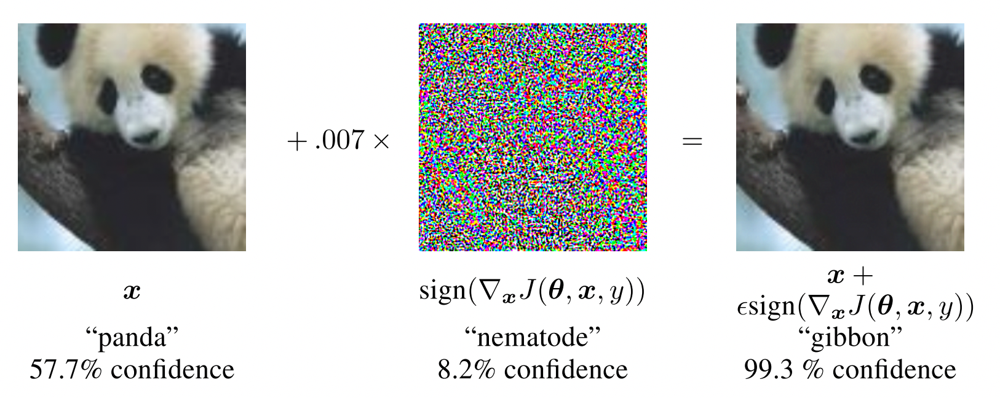
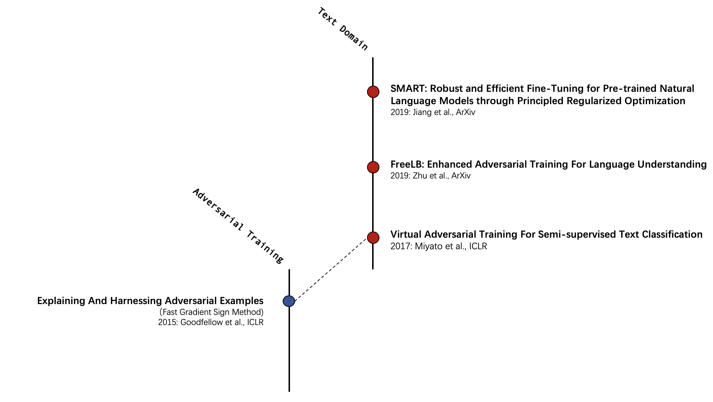

# 利用对抗训练提升NLP模型效果--专题(一)

Photo by [Nahel Abdul Hadi](https://unsplash.com/@nahelabdlhadi?utm_source=unsplash&utm_medium=referral&utm_content=creditCopyText) on [Unsplash](https://unsplash.com/?utm_source=unsplash&utm_medium=referral&utm_content=creditCopyText)

>引言：自从第三波人工智能浪潮以来，基于深度学习的神经网络已经占领了视觉、自然语言处理、搜索等领域。『像一个黑盒子』是神经网络一直为大家诟病的特点。渐渐的开始有人发现这个黑盒子充满了漏洞，就此基于神经网络的攻防战拉开了序幕。不过就像免疫系统之于病毒，对于模型来说，合理使用攻击算法可以一定程度的提升模型的鲁棒性和效果。

## 什么是对抗训练？

2012年，Szegedy[^1] 等人独立发现了一个很诡异的现象：作者们发现通过一些简单的操作，就能构造出肉眼不可察觉、但是却可以让深度神经网络『瘫痪』的样本----对抗样本。如下图所示，在熊猫的图片上施加指定的噪声，模型会将熊猫识别为长臂猿，而且置信度高达99.3%。

更诡异的是这些对抗样本的鲁棒性非常好：假如我们通过一部分数据集训练了一个网络A，针对A网络构造出来的攻击样本S，在另一个批数据训练的网络B上这些攻击样本的仍然能攻击成功，哪怕是网络参数发生了变化结论同样成立。

这份研究说明在通过监督学习得到的神经网络上，有着我们不为熟知的『盲点』。

自此之后，大批研究者受到了启发，发明了一系列的攻击和防守算法，找到模型的『盲点』使模型失灵；还有一批学者，研究了一系列防守方法以抵御攻击算法。这些算法都是**对抗训练算法**。

在这一系列的工作中，GoodFellow[^2] 等人发现对抗样本如果能够运用在正常的训练过程中，对抗样本在一定程度上可以起到正则训练的作用。从流形空间的角度上讲，对抗样本更像是难度更高的样本，批量补充这样的样本可以达到数据扩充 (Data Augmentation) 的作用。从机器学习角度来讲，这些样本补充了神经网络的盲点区域，可以减弱模型过拟合、增加模型泛化性，达到正则项的作用。

我们的这系列专题将着重基于对抗学习算法的上述两个性质进行展开。期望能通过梳理文本领域时下先进的对抗训练算法，来汇总一批较方便的、能提高模型性能的一些硬核技巧。

## 文本对抗训练算法演进

按照对抗算法能够接触到模型内部信息的程度，对抗算法通常被分为白盒算法和黑盒算法。我们在这里主要关注白盒算法。

基于白盒的算法中，有一系列的工作基于模型的梯度进行攻击。这一类工作的出发点很朴素：由于损失函数的梯度方向代表着损失值增大的方向，那么很自然的会想到，如果我们把输入的样本当做可以学习的参数，把样本接受到的梯度施加到样本上，那么我们就得到了一份攻击样本。这类方法的早期经典工作是上文提到过的文献[2], 简称为FGSM (**F**ast **G**radient **S**ign **M**ethod)[^1]。

最初，这类方法都在图像上展开了各种实验。因为在图像领域，每一个像素点都是一个实数，也就是0~255的实数。那么根据 FGSM 算法，图像和梯度很容易可以通过加和操作得到攻击样本。但是在 NLP 领域，每一个字通常都是用独热的形式进行表达，那么这样的表达就很难套用到上面的方法中。但是近年来，对于一个字的表达逐渐的由独热表达演变成了分布式表达，也就是我们常说的词嵌入 (Embedding)。这样我们就可以套用上述工作到 NLP 中。

例如上图中，可以看到 2017年，将对抗学习和半监督结合的工作 VAT，将对抗学习引入到 Transformer 家族的 FreeLB、Smart 都是在 NLP 领域内的最新工作。

针对这一系列工作我们将在后续的专题中进行展开。

[1] Szegedy C, Zaremba W, Sutskever I, et al. Intriguing properties of neural networks[J]. arXiv preprint arXiv:1312.6199, 2013.

[2] Goodfellow I J, Shlens J, Szegedy C. Explaining and harnessing adversarial examples[J]. arXiv preprint arXiv:1412.6572, 2014.

