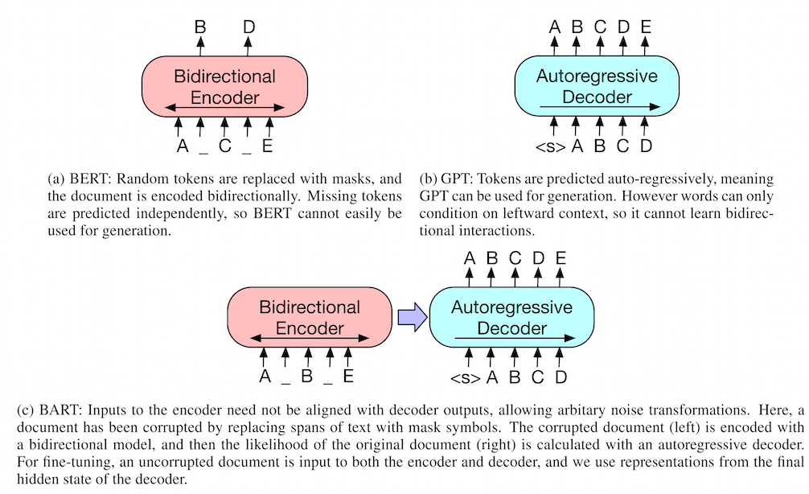

# Cross Lingual Boosting Machine Learning

Photo by [Romain Vignes](https://unsplash.com/@rvignes?utm_source=unsplash&utm_medium=referral&utm_content=creditCopyText) on [Unsplash](https://unsplash.com/s/photos/translation?utm_source=unsplash&utm_medium=referral&utm_content=creditCopyText)

>  引语: 在20世纪70到80年代，第一波人工智能浪潮中，有很多有意思的关于人工智能的假想实验被提出来。其中一个实验叫做『汉字屋』实验。该实验试图模拟图灵测试，用以反驳强人工智能观点。该实验假定我们有一间屋子，里面有一些汉字和英文提示指令，如果我们递一张用英文书写的纸条到屋子里，随后就会有汉字纸条递出来。但是整个过程中，我们并不知道是机器还是人类在帮我们做这件事情。其实在这个假想实验中，这个汉字屋内的个体做的事情就是我们当下机器翻译的事情。

## 前言:

2018年以来，NLP 开始跨入大规模无监督预训练到下游任务微调的学习范式，其中一个细分领域是面向多语言的预训练和神经网络机器翻译。这个领域汇聚了知识表示、迁移学习、小样本学习等多种机器学习技巧，是一个很有趣的领域。

### 跨语言预训练

能够利用大规模的无监督数据进行通用语义任务的训练越来越多的被证明是对下游任务有利的，在跨语言预训练这个领域也不例外。2018年底，Devli 等人提出了基于多种语料的预训练方法 BERT， 展示出了无监督预训练对于跨语言任务的潜力。2019年，Conneau 等人进一步的提出了结合跨语言监督任务的预训练方法 XLM。除此之外，还有学着提出了使用跨语言词汇恢复和段落检测作为辅助任务提升预训练效果 ([Uniencoder: Huang et al., 2019](https://arxiv.org/abs/1909.00964))，还有学着增加了对齐语料的表达应该相似的约束进入到预训练中 ([Cao, 2019](https://openreview.net/forum?id=r1xCMyBtPS))，在2019年底, ([Conneau et al., 2019](https://arxiv.org/abs/1911.02116)) 等人提出了基于更多语种的预训练模型 XLM-R.

### 面向神经网络机器翻译的预训练

因为 NMT (Nerual Machine Translation, 神经网络机器翻译) 天然的多语种属性，所以很自然的会想到，跨语言的预训练模型能否对 NMT 的效果产生益处呢？2019年，[(Song et al., 2019)](https://www.microsoft.com/en-us/research/uploads/prod/2019/06/MASS-paper-updated-002.pdf) 等人率先提出了面向序列生成的预训练模型 MASS，该模型通过让解码器进行语句重建的方式完成预训练；上文提到的 XLM 模型中，由于训练任务中含有机器翻译的训练目标，所以也可以自然的过渡到具体的 NMT 微调任务。随后 ([Liu et al., 2020](https://arxiv.org/pdf/2001.08210.pdf)) 等人提出了模型 mBART， 该模型以多语言语料为输入，引入了 [BART](https://arxiv.org/pdf/1910.13461.pdf) 模型的训练目标，在监督机器翻译和多种情况下的无监督机器翻译场景下做了验证。

## 跨语言无监督预训练模型

### mBERT

[mBERT](https://github.com/google-research/bert/blob/master/multilingual.md) 模型出来自于 [Devlin et al., 2019](http://arxiv.org/abs/1810.04805)，是 multi-lingual BERT的意思，该模型使用了104 个语种的语料作为训练数据，训练的方法与 BERT 相同，具体来说如下图所示，使用了 MLM(Mask Language Model) 做为训练目标，例如针对输入的句子中指定的词汇进行掩盖，使得模型能够预测被掩盖词原本的内容。

不过有意思的是，([Karthikeyan et al., 2019](https://openreview.net/pdf?id=HJeT3yrtDr)) 等人对 mBERT 做了深入分析，有一些很有用的结论：

- 跨语言预训练的效果优劣和是否共享词表无关
- 跨语言预训练的效果和共同训练的语言是否结构相似以及模型的深度有关有关 (例如英语和法语)

### XLM

在 mBERT 的基础上，([Conneau et al, 2018](https://arxiv.org/abs/1901.07291)) 提出了增加一个翻译任务作为训练目标，如下图所示，

该任务在上文提到的 MLM 之外，还增加了右侧的翻译任务，例如 `the curtains were blue` 于 `les rideaux étaient bleus` 作为一对平行语料，共同参与预测遮盖词的内容。例如在预测英文的遮盖词的时候，模型是能够参考法语部分的信息的，从而达到双语共同学习的目的。

### Unicoder: A Universal Language Encoder by Pre-training with Multiple Cross-lingual Tasks

以 mBERT 和 XLM 为基线，(Huang et al., 2019) 提出了三种新的跨语言的训练目标：

- a) 跨语言的词汇恢复，例如下图种，利用中文的信息对英文信息进行融合表达，再对英文进行语句重建；

- 构造语句级别任务：判断相邻的两个非同语种的句子，是否存在上下文关系；
- c) 基于双语语料的 MLM 任务。

（效果怎么样？ 对于MT怎么样？有什么优势？）

### On the Cross-lingual Transferability of Monolingual Representations

前人的工作都将不同语言的语料混合在一起进行训练，那这种训练方式是必须的吗？ [Artetxe et al. (2019) ](https://arxiv.org/abs/1910.11856) 做了一个很有意思的补充实验：

在这篇文章里，作者证明：多语种预训练并不要求词表共享、共同训练。例如在上图中，先 

- a) 训练英文的模型；
- b) 然后固定模型参数，只替换 emb 层，训练法语部分；
- c) 用接回英语的 emb 做下游的 finetune 任务；
- d) 替换回法语的 emb 直接开始不用训练的 zero-shot 级别的法语 finetune任务。

在实验效果中，这种 zero-shot learning一样很好。

### XLM-R

[(Conneau et al,. 2019)](https://arxiv.org/abs/1901.07291) 在上文提到过的 XLM 的基础上，进一步的扩大了语料至100种，并且融合更大规模的数据， 2.5 TB的CommonCrawl，完成了预训练。

至于说这个 ***R*** 是什么意思？其实是 RoBERTa 的简写，继承了 RoBERTa 将 BERT 训得时间更长、数据更多的精髓，所以 这个 ***R*** 字一点也违和。

## 跨语言表达增效神经机翻

在预训练模型的加持下，甚至可以做到无需额外的平行语料，进行无监督机器翻译。但是通常情况下，有语料、监督学习的机器翻译效果显然会更好。因此我们将注意力更多的放在监督机器翻译上以及一些语料欠缺的语种的机器翻译问题的解决。

### XLM

XLM[R] 发现，对于 NMT 来说，预训练带来的收益是很大的，如下图所示，只要加入 pre-training 的 XLM，效果就会有提升，对比 SOTA 的 BLEU 涨了 0.5 个点 (越大越好)。

对于小语种来说，通过增加跨语言的语料进行 pre-training，也能为小语种的效果带来提升，如图中对于尼泊尔语 (Nepali)，通过增加英语与印度进行共同预训练，在混淆度 (perplexity) 这个指标上，有明显的下降 (越小越好)。

除了 pre-training 带来的效果收益以外，XLM 在进行翻译任务的微调时，还引入了一个比较通用的技巧：BackTranslation, 即假设我们想要将语言 $Src$ 翻译至 $Trg$，记作 $ Src \rarr Trg$，当 $Src$ 语料太少时，我们可以将 $Src \rarr Trg \rarr Src'$，这样就得到了 $Src'\rarr Trg$ 的语料，从而达到了扩展了语料的目的。

当然 XLM-R 在 XLM 上做了扩展，虽然没有做关于 NMT 的实验，不过相信效果不会变差，具体项目目录在[这里](https://github.com/facebookresearch/xlm)

### MASS

与上述工作中只训练 encoder 不同，(Song et al, 2019](https://arxiv.org/abs/1905.02450)) 提出了一种专门同时训练 encoder 和 decoder 的网络结构。

如下图所示，该工作中将输入序列中的词进行掩码，在解码端，只解码这些被掩盖的词汇。不过需要注意的是，解码端仍然需要位置占位符以保证模型知道解码的位置是哪里；以及为了保证解码时，信息不被泄露，例如解码短为了生成 $X_4$，模型不应该看到 $X_4$ 及后面词汇的信息。

至于翻译任务来说，模型在预训练过程中，并没有使用跨语言之间的交互信息作为训练目标，不过模型使用了不同的语料共同训练该模型，对于每一种语言来说，都可以无监督的构造出来解码任务。

### Multilingual Denoising Pre-training for NMT

这篇论文是基于 ([Lewis et al,. 2019](http://arxiv.org/abs/1910.13461)) 提出的模型 BART 进行改进的工作，BART 的预训练任务如下图所示：

该文章的一个比较重要的改进点是使用了一个从 Common Crawl 提取出来的多语种的语料 CC-25 进行预训练，训练过程中没有用平行语料、或者机器翻译的训练目标。从结果上，要由于 XLM-R 和 MASS。

