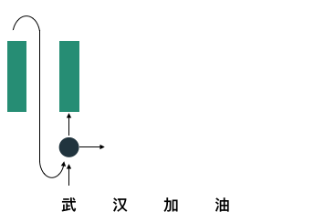
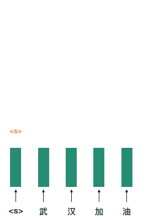

# 天下武功为快不破，NLP锤子速度演化摘要

 Photo by [Christopher Burns](https://unsplash.com/@christopher__burns?utm_source=unsplash&utm_medium=referral&utm_content=creditCopyText) on [Unsplash](https://unsplash.com/?utm_source=unsplash&utm_medium=referral&utm_content=creditCopyText)

> **引语:** 保罗·格拉汉姆 (PaulGraham)，Viaweb创始人(后被Yahoo收购)、YCombinator投资公司创始人在其著作《黑客与画家》中提到: Viaweb在当时之所以能取得成功，主要原因在于创业初始期间使用了 Lisp 语言完成快速的功能迭代，甚至在竞争对手的新功能刚上线一天内，迎头赶上。 埃里克·施密特 (Eric Schmidt) 在《重新定义公司:谷歌是如何运营的》中提到，想要保持产品的成功及品质的卓越，秘诀就是快速。 
>
> 『天下武功为快不破』，武功出招要快，做产品要快。 学术圈何尝不是一个众家出招的江湖，众家众派各显其能。 尤其在模型变得越来越大的 NLP 圈，如何让模型训练的快而且付有成效，更是摆在众人面前的一大难题。 

## 前言

时值2020年初，回望过去几年，NLP (Natrual Language Processing，自然语言处理) 领域可谓翻天地覆。 人类的自然语言本质上是时序信号，例如我们读文章的时候，一定是沿着一个方向阅读文字，要么左右读，要么上下读。 由于 RNN (Recurrent Neural Network 循环神经网络) 天然的可以处理时序信号的特性，RNN受到了广泛的应用，例如利用 RNN 进行文本分类、摘要生成、分词等应用。 但是 RNN 结构有着本质上的缺点:太慢了！RNN 需要对输入的时序信号----一段文本----依次读入，这种运作方式没有办法释放 GPU 的潜在性能，造成了设备算力上的浪费。 

而在如火如荼的隔壁领域 CV (Computer Vision) 届，CNN (Convolutional Neural Network) 结构由于参数共享、并行计算等优良特性而大行其道。 

逐渐的 NLP 届的学者们开始逐渐拥抱 CNN。 

更进一步，有人提出是否可以放弃 CNN，用对 GPU 设备更友好的线性运算完成所有的操作。 在2017年，谷歌的科学家团队提出了一个叫做 Transformer (和变形金钢是同一个英文单词) 的结构。这个结构的运算复杂度在一定的条件下更小，性质也更好。

至此，NLP进入了一个全新的时代。 

## 锻造锤子前，你需要一个钉子: 序列生成

为了更好的体现出 NLP 领域主流工具性能的变化，这里需要选择一个落地方向来结合讲解。 见证这一系列历史变迁的非『序列生成』莫属了。 

### 什么是序列生成任务?

翻译工具想必读者不会感到陌生，平时的工作中，少不了借助翻译软件的帮忙。 语言翻译是序列生成的一个完美应用案例。 

例如我们在翻译软件中输入『哈尔滨是一座美丽的城市』，翻译软件就会输出『Harbin is a beautiful city』，对于NLP来说，我们认为，自然语言是由一系列符号组成，例如『哈』『尔』『滨』都是方块形的符号，『Harbin』又是另一种曲曲折折的符号，那么将这些方块形的形态各异的符号变化到另一种一连串的曲曲折折的符号的过程，我们称之为『序列生成』。 

除了经典的翻译应用，摘要生成、对话机器人也是序列生成的常用落地点。 

### 序列生成网络常用范式

通常情况下，面对序列生成任务，我们会考虑两种方法来组织输入侧的信息，如果我们称网络输入的动作为编码，称网络输出动作为解码，则：

1. 可以在编码阶段将输入侧的信息压缩成一个向量，解码阶段以该向量为起始完成解码。不过由于我们把输入都压缩到了一个向量中，显然会造成信息瓶颈等问题；

2. 另一种使用方式是保持编码阶段每一个词信息，在解码阶段完全的利用每一个词的信息，达到不丢失信息的目的，当然这样做会增加计算量。

   

## 你要的锤子在这里

### RNN 循环神经网络

利用 RNN 来解决序列生成任务是非常符合知觉、也非常契合序列生成任务的一个方案。因为 RNN 作为一个编码器将上一个时刻和当前时刻的信息做为输入，以上图中对『汉』这个字编码为例，RNN 的输入分别为『武』字的信息和『汉』字的信息。

在解码阶段，如图所示，可以将输入序列最后一个字的信息输入至负责解码的RNN，得到预测值，直至遇到结束标签</s>位置。

虽然RNN天然适合文本处理，但是从上图中能直观的感受到，RNN的计算弱点在于每一次的编解码，都需要一步一步的循环才能进行下去，这样的机制无法发挥 GPU 并行计算的能力，这极大的浪费了 GPU 的算力。

典型的工作如:

- Neural Machine Translation by Jointly Learning to Align and Translate 

- Sequence to sequence learning with neural networks

- Learning phrase representations using RNN encoder-decoder for statistical machine translation

### CNN 卷积神经网络

正是因为 RNN 天然的工作机制导致有硬伤，大家还是探索是否可以利用 CNN 来解决问题。

首先得益于CNN可以并行的优势，那就可以解决 RNN 这种基于 for 循环的训练模式，提高训练速度。在 RNN 擅长的读入全局即整句信息的优势方面，只要堆叠的CNN层数足够多，那么就可以达到RNN掌握全局信息的效果一样。 例如图中，对于尺寸为2的卷积核来说，堆叠4层之后，该层 (橘黄色部分) 就蕴含了输入层 (蓝色部分) 的5个词的信息，如果能够增大卷积核尺寸，那么就可以通过堆叠更少的层来达到蕴含输入层所有词的效果。

从该图可以看出，随着网络堆叠的层数加深，受视野会逐渐变大, 图自[4] 

例如对于[^1]中使用了空洞卷积扩大了卷积核的尺寸，让卷积核的受视野变得更大。但是空洞卷积有一个问题，会产生棋盘格效应[^2]，为了解决这个问题同时保证受视野不变小，同时不要增加参数量，还有人提出了用深度可分离卷积来代替空洞卷积[^3]。

### Transformer 变形金刚编码器

Transformer 模型是2017年底 Google 团队提出来的模型。

这里感慨一下，该模型中的很多技巧其实都在上面的很多文献中有影子，例如

- ConvS2S[^3] 中对于Position Embedding的应用; 
- ConvS2S[^3] 中对于 Attention 中类似 MemoryNetwork 的解读;
- ByteNet[^1] 中基于Residual的堆叠结构 (当然最开始可以溯源到HeKaiming的ResNet)

从这些点中能看出来，学术界作为一个科研共同体，大多都创新都是站在巨人的肩膀上前行问世的。 

脱离了 RNN 和 CNN 结构之后，新一代模型主打的卖点是 Attention 机制，正如 Transformer 结构提出的文章标题《Attention is All You Need》一样，Attention结构是最重要的机制。 

那为什么要抛弃 RNN 和 CNN，拥抱 Attention呢?

对于 RNN 来说:其实根据上文的结论，我们能知道 RNN 需要 $O(n)$ 顺序的操作，此处n是句子的长度。 而当 $n < d$ 时，Attention 的操作是比 RNN 的时间复杂度低的[^5]。 

对于 CNN 来说: 上文我们有提到，为了掌握全局，即整个句子的信息，需要将 CNN 堆叠许多层才可以做到，当句子长度变大时，模型的复杂度要随之提升才能继续满足该特性，而 Attention 机制则不需要。 

 Attention 结构图，图自[5] 

所以说 Attention 机制牛，并且以其为核心的 Transformer 编码器一举成了2018~2019年 NLP 的主要势力，以 Transformer 为主干网络的 GPT、BERT、XLNET、ERNIE、ALBERT、RoBERTa 先后问世，彻底刷新了 NLP 的所有任务效果。 

### Reformer 

历史的车轮滚滚向前，虽然 Transformer 系列模型的能力已经得到了充分的证明，但是也有人看到了其暴露出来的问题愈发严重: 该系列模型太大了！

 依据已发表论文，这里列出了一些主流模型的参数量，可以看出当前模型规模变得越来越大，模型训练耗费的金钱、时间越来越多。CV部分数据来源<a href="https://www.jeremyjordan.me/convnet-architectures/">这里</a>。价格数据来源: <a href="https://www。amazon。com/NVIDIA-Tesla-Volta-Accelerator-Graphics/dp/B07JVNHFFX/ref=mp_s_a_1_1?keywords=tesla+v100+32gb&qid=1577638823&sr=8-1" >amazon售卖数据</a>

ICLR 2020 中有一篇高分文章叫做，REFORMER: THE EFFICIENT TRANSFORMER，该文章介绍了两种提高Transformer效率的技术:

- 文章提出了将点乘注意力 (dot-product attention) 替换为一个使用局部敏感哈希 (locality-sensitive hashing) 的点乘注意力，将复杂度从 $O(L2)$ 变为 $O(L \log L)$，此处 $L$ 指序列的长度。 
- 此外，研究者使用可逆残差 (reversible residual layers) 代替标准残差 (standard residuals)，这使得存储在训练过程中仅激活一次，而不是 $n$ 次 (此处 $n$ 指层数)。 最终的 Reformer 模型和 Transformer 模型在性能上表现相同，同时在长序列中拥有更高的存储效率和更快的速度。

这其中涉及到了一些新的知识点，可以先阅读[大规模数据的相似度计算：LSH算法 ](https://zhuanlan.zhihu.com/p/46164294)进行预习。

## 总结与展望

身处2020年伊始，望古知今，相信2020年 NLP 领域内，会出现更多的 Transformer 革新者。也只有这样，才能缓解当前大公司垄断模型训练算力的现状，才能促成更好的社区良性循环与进步。

[^1]: Neural machine translation in linear time

[^2]: Deconvolution and checkerboard artifacts。 

[^3]: Convolutional Sequence to Sequence Learning

[^4]: WAVENET: A GENERATIVE MODEL FOR RAW AUDIO

[^5]: Attention is All You Need

